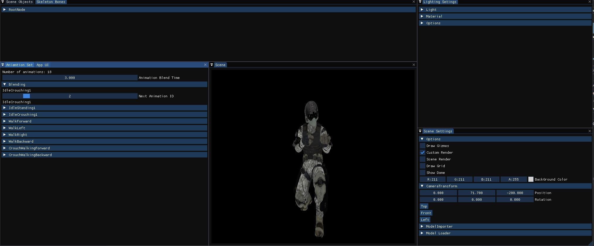

# Vishv Game Engine

Vishv is a game engine made on DirectX 11 in C++ 17. The engine uses Enity Component System to make easy data driven games. 

## The Engine

The UI


## Demo

### [Player Enemy Demo](Vishv_GE/Demo/01_PlayerEnemy/Images)

This is the first Demo Project made using the ECS it spawns a sample area with a ground and 2 walls, also it spawns 2 Enemy Zombie who roam around until the player is detected and then chase and attack the player. Systems being used are:

* AI for Enemy
  * Path finding A star
  * Steering Behaviours 
  * Finite State Machine
 * Graphics
  	* Model Animation
  	* Model rendering
* Physics
  * Collision Detection
  
#### Click on the demo name to see detailed images of the demo. 

### [Animation belnding](Vishv_GE/VGP334_Animation/05_AnimationBlending1/images)



This is the final demo project that is there to test and show animation system for Vishv, it supports adding animations and blending between them the demo showcases import of model, textures, skeleton, animations and skining shader writen for it.

here the blending slider can be used to change between different animations

#### Click on the demo name to see detailed images of the demo. 

## Using Component System

These instructions will help you in developing your own components in your projects  

### Adding Components To A Game Object

```
auto objectHandle = mGameWorld.Create(std::filesystem::path(), std::move("Object Name"));
objectHandle.Get()->AddComponent<Components::TransformComponent>();    

*note
The engine will support prefabs and create will add components using that 
```

### Making The Component

This is an example component 

In Header
```
Class HealthComponent : public Vishv::Compoents::Component
{
  public:
  META_CLASS_DECLARE
  uint32_t mHealth;
};
```
In Cpp
```
META_DERIVED_BEGIN(HealthComponent, Vishv::Components::Component)
	META_FIELD_BEGIN
		META_FIELD(mHealth, "Health")
	META_FIELD_END
META_CLASS_END

```

## Built With

* [DirectX 11](https://gizmodo.com/what-directx-11-is-and-what-it-means-to-you-5582218) - Graphic library used as base  
* [DirectXTK](https://github.com/microsoft/DirectXTK) - Library used for textures and sound
* [Dear ImGui](https://github.com/ocornut/imgui) - GUI Library used
* [AssImp](http://www.assimp.org/) - Library used to import 3D Assets
* [PhysX](https://github.com/NVIDIAGameWorks/PhysX) - External Physics Library that is still being integrated 
* [RapidJSON](https://rapidjson.org/) - Library being used for files 
* [Mixamo](https://www.mixamo.com/#/) - For 3D Assets

## Authors

* **Bhavil Gupta** - *Initial work* - [InFaNsO](https://github.com/InFaNsO)

## License

This project is licensed under the MIT License - see the [LICENSE.md](LICENSE.md) file for details

## Acknowledgments

* Peter Chan who has guided and mentored me throughout the way while making this engine
* My inspiration [Unity 3D](https://unity.com/) 
